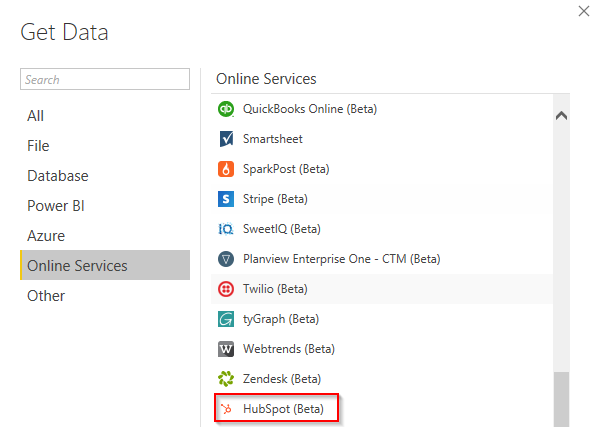
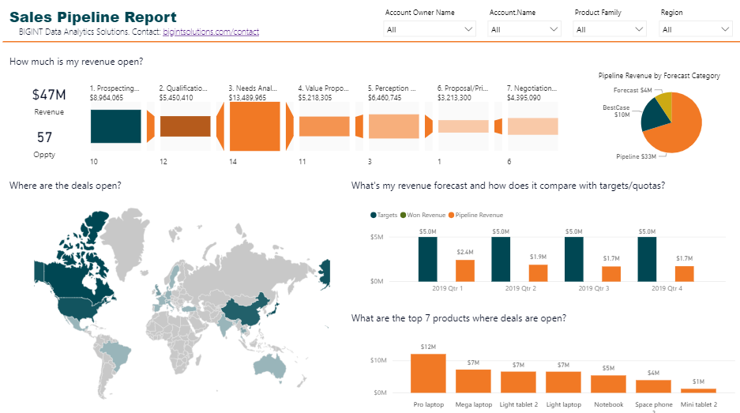
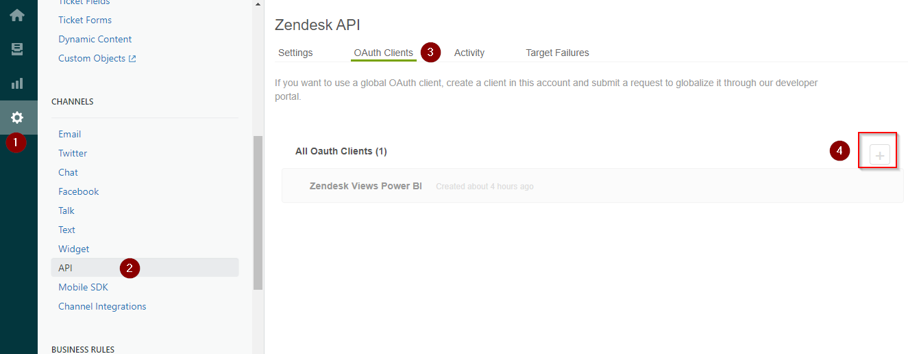
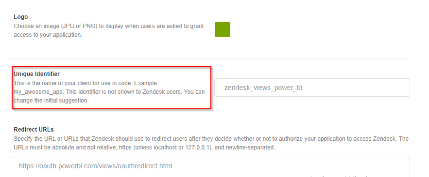
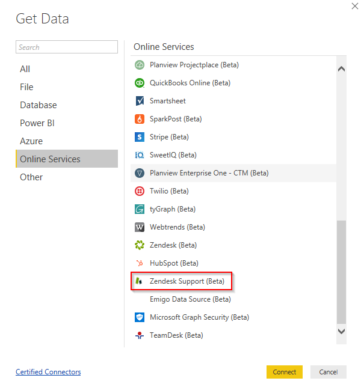
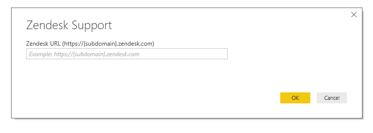
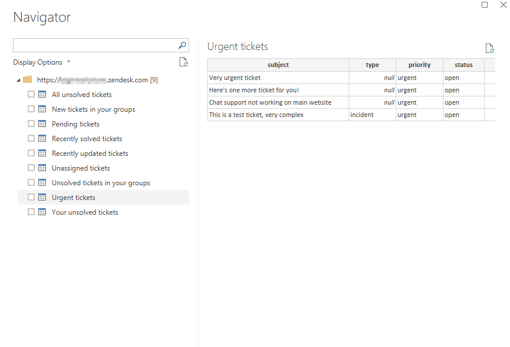
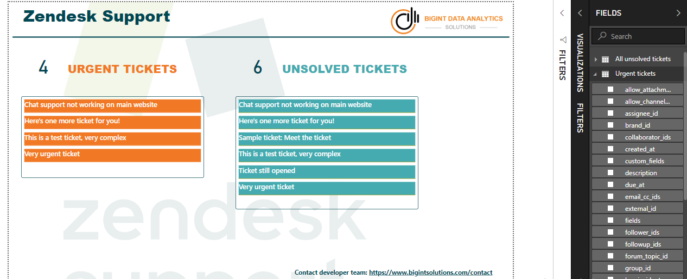

# Microsoft Power BI Custom Data Connectors
This is a repository of custom data connectors to Power BI developed by team at [bigintsolutions.com][bigintsolutions]

## Available custom data connectors
* [HubSpot](#the-hubspot-connector)
* [Zendesk Support Tickets](#the-zendesk-support-tickets-connector)
* [Zoho (coming soon)](#the-zoho-connector)

## Need premium support?
If you need premium support on these connectors or want us to develop new connectors, feel free to reach us at [bigintsolutions.com/contact][bigintsolutions-contact]

## The HubSpot Connector

The most requested data connector is here! Connect to HubSpot data and visualize your sales pipeline funnel, deal owner performance, win rate and many more metrics.

**I'm excited, how do I get started?**

Step 1: Get HubSpot key for your account

[Get HubSpot Key here][hubspot-key]

Step 2: Download HubSpot.mez file from HubSpot\build folder in this repository

Step 3: Copy this file under C:\Users\\\<Your_User_Name>\\Documents\Microsoft Power BI Desktop\Custom Connectors

*If the folders do not exist, create them

Step 4: Open Power BI Desktop, set "(Not recommended) Allow any..." under Options/Data Extensions 

Step 5: Restart Power BI Desktop, navigate to "Get Data" -> "More..." -> "Online Services" and you will find "HubSpot (Beta)), select it.

Step 6: Input Key of your HubSpot Account

Step 7: You can now select objects from your HubSpot account

After you have imported the data, you can create a stunning view of the data like this:

## The Zendesk Support Tickets Connector

Extremely useful connector to fetch Zendesk Support views and tickets information from Zendesk. The connector uses OAuth 2.0 to access your Zendesk's account data.

** Setup **

1. Register an OAuth 2.0 client.

Make sure to provide "redirect_url" as https://oauth.powerbi.com/views/oauthredirect.html 

Read more [here][zendesk-app]

See screenshot below for quick navigation

2. Grab client id and secret

Client Id is nothing but the unique identifier.

3. Download the .mez file from ZendeskSupport\build folder from this repo

4. Rename ZendeskSupport.mez to ZendeskSupport.zip

5. Unzip the contents, and edit config.json in Notepad or any text editor

6. Replace your_client_id and your_client_secret with your apps client_id and client_secret

7. Save the file, and zip the contents again. Please make sure you select all content (Ctrl+A), right click and send to Compressed (zipped) folder.

8. Rename the zip back to .mez

9. Copy this to %USERPROFILE%\Documents\Microsoft Power BI Desktop\Custom Connectors

Note: Create folders if they do not exist.

10. Open Power BI Desktop, set "(Not recommended) Allow any..." under Options/Data Extensions 

11. Restart Power BI Desktop, navigate to "Get Data" -> "More..." -> "Online Services" and you will find "Zendesk Support (Beta)), select it.

12. Provide your Zendesk account full URL and follow along.

If everything is set correctly, then you will see a list of all active views. You can select whatever views you want data for.

And visualize it something like this:

## Questions/Issues?
Please open an issue on GitHub. One of our developers would connect with you on the issue.

[hubspot-key]:https://knowledge.hubspot.com/articles/kcs_article/integrations/how-do-i-get-my-hubspot-api-key
[zendesk-app]: https://support.zendesk.com/hc/en-us/articles/203663836#topic_s21_lfs_qk

[bigintsolutions]: https://www.bigintsolutions.com
[bigintsolutions-contact]: https://www.bigintsolutions.com/contact