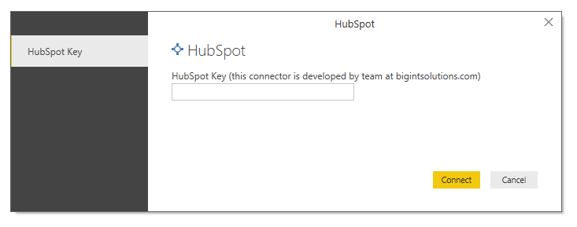
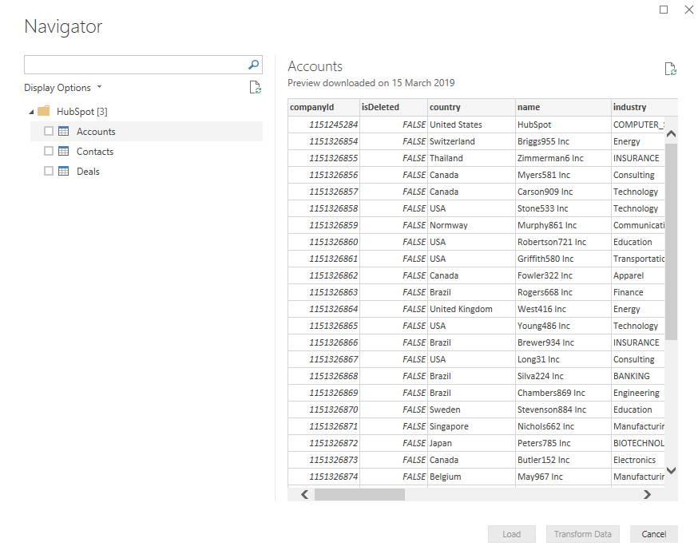

# Microsoft Power BI Custom Data Connectors
This is a repository of custom data connectors to Power BI developed by team at bigintsolutions.com.

## Available custom data connectors
* [HubSpot](#the-hubspot-connector)
* [Zoho (coming soon)](#the-zoho-connector)
* [Zendesk Tickets (coming soon)](#the-zendesk-tickets-connector)

## Need premium support?
If you need premium support on these connectors or want us to develop new connectors, feel free to reach us at bigintsolutions.com/contact

## The HubSpot Connector

The most requested data connector is here! Connect to HubSpot data and visualize your sales pipeline funnel, deal owner performance, win rate and many more metrics.

####I'm excited, how do I get started?

Step 1: Get HubSpot key

[Get HubSpot Key here][li-api]

Step 2: Download HubSpot.mez file from HubSpot\build\v1 folder in this repository

Step 3: Copy this file under C:\Users\\\<Your_User_Name>\\Documents\Microsoft Power BI Desktop\Custom Connectors

*If the folders do not exist, create them

Step 4: Open Power BI Desktop, set "(Not recommended) Allow any..." under Options/Data Extensions 

Step 5: Restart Power BI Desktop, navigate to "Get Data" -> "More..." -> "Online Services" and you will find "HubSpot (Beta)), select it.

Step 6: Input Key of your HubSpot Account

Step 7: You can now select objects from your HubSpot account

After you have imported the data, you can create a stunning view of the data like this:

## Questions/Issues?
Please open an issue on GitHub. One of our developers would connect with you on the issue.

[li-api]:https://knowledge.hubspot.com/articles/kcs_article/integrations/how-do-i-get-my-hubspot-api-key